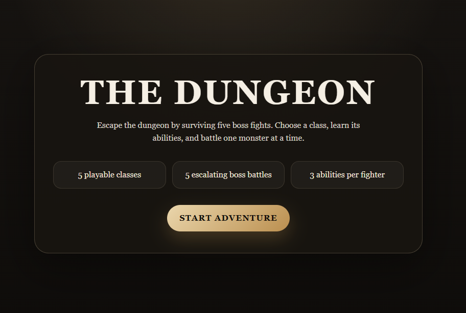
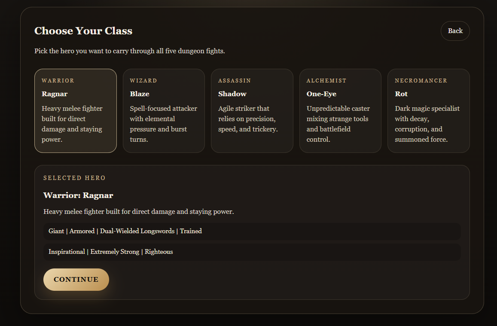
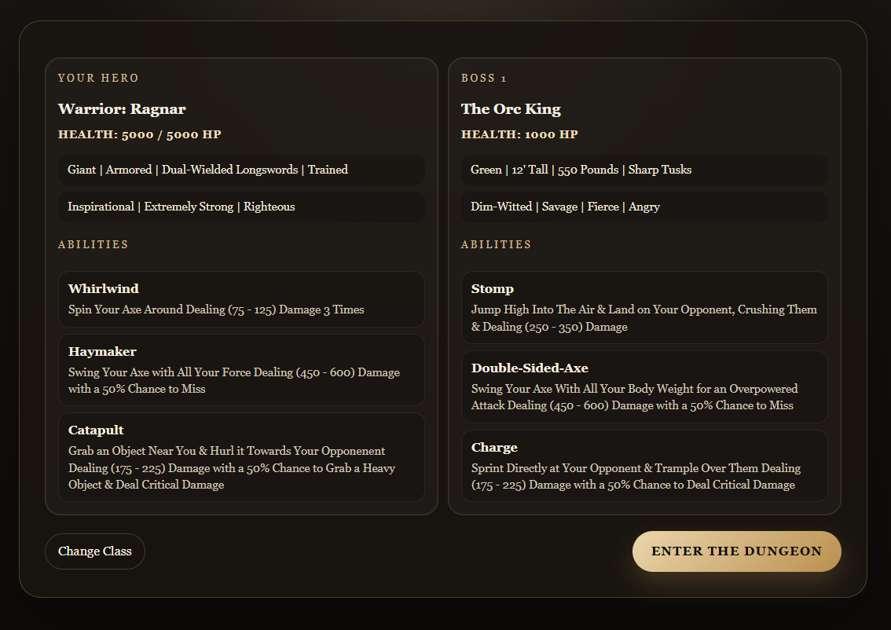
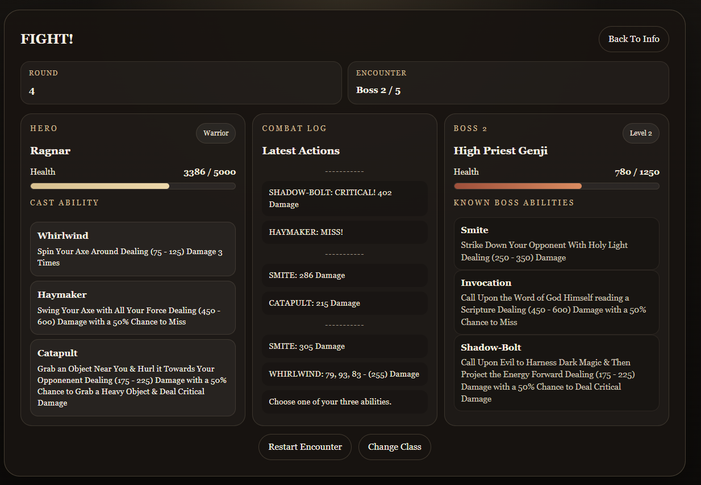
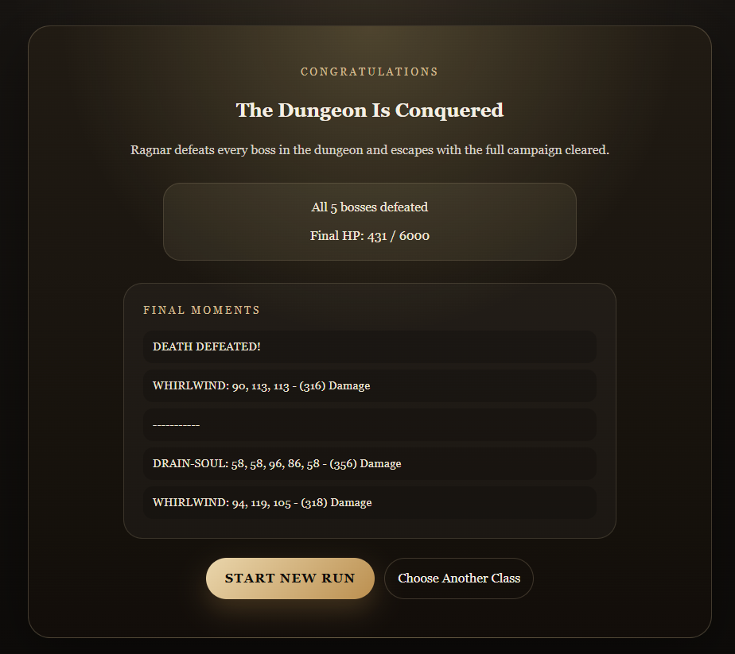

# The Dungeon

A turn-based dungeon boss battle game built with React and Java.

## Features
- 5 playable hero classes
- 5 escalating boss encounters
- Turn-based ability combat
- Randomized damage, misses, and critical hits
- Health carryover between fights
- Victory, defeat, and final dungeon clear screens

## Technologies
- JavaScript
- React
- Vite
- CSS
- Java

## Installation
cd web
npm install

## Run
npm run dev

## Screenshots

### Start Screen

### Class Select

### Boss Matchup

### Battle Screen

### Victory Screen

